# A-to-Mind company catalog

**Updated** 2026-09-24 late afternoon (ET). Shared parts map + plain-wording pass; soft-tag lock + Aquifer Yield earlier today. Prior organize night: 2026-09-23 evening.  
**Living.** Face + all Books in one map. Living ops doc — one company, not a pile of theses.

---

## Company doctrine

**Combine everything. Categorize cleanly. Throw nothing out.**  
Every serious idea, Domain, salvage find, and craft pattern is filed into **one company catalog** — added to an existing venture file or the Inbox, never left as a separate orphan thesis.

**One company, one catalog. Not six companies.** Soft tags are navigation only — not walls. There are no letter families.

**Method:** A-to-Mind **breaks systems into small clean parts**, then combines those parts into one coherent Books list. Break down first; combine second. Nothing thrown out.

**Ambition (private):** do everything better than everyone ever. Surpass every site, invent new tech, run real money books — privately. The Face never announces this.

**Face vs Books:** blank Void at a-to-mind.com (capabilities only, no brag). Domains + this catalog hold the full machine. Ambition lives in the Loop, not in homepage copy.

**Decision 2026-09-25: Void is the front door (Adam).** Claude asked whether Void ever becomes the way customers come in, or stays fully separate from the ventures. Adam: "you can ask void about itself and it can give floating futuristic looking pages that explain anything, if the void aims to be the best website ever of course it can show text and products, you can summon anything into the void, it's just humble and not in your face like modern sites, besides it aims to do so much it can't show it all if it tried, you just have to ask." So: Void stays blank and shows nothing until asked, but **anything can be summoned on request**: explainer pages (floating pages that explain anything, including Void itself), text, products, and **each venture's intake**. Ventures are **summonable capabilities, not advertised copy**. This **refines, not reverses**, the Face vs Books line above (kept as written): the rule against bragging still holds (no homepage copy, scoreboard, pricing, or venture names shown unasked), and summoning is allowed. Reason: Void aims to do too much to show, so you just ask. Nothing here unlocks a build, a venture, or outreach.

**Global:** A-to-Mind aims to be global (Adam, 2026-09-24). Lakeland / Polk is the first beachhead, not the ceiling.

**Local problem, worldwide prevention (Adam, 2026-09-24):** a problem found in one place can still become a worldwide prevention fix. Each venture has a rescue mode (deadline-driven; how customers arrive) and a prevention mode (recurring; keeps the file ready before the gatekeeper asks). Prove locally, then generalize with jurisdiction rule sets.

---

## Current posture

**Organize; no outreach.**  
Fold every new thesis into the closest venture file. No external reach-outs until Adam says outreach resumes. No CPA emails. No software builds unless Adam unlocks (when unlocked: Handoff first node = CF Worker ingest before CPA n8n). No `void.html` edits from this board.

2026-09-24 afternoon: soft-tag filing lock (`local/place`->`place/ops`; `power/civic`->`resource/commons`) + Adam-named `aquifer-yield.md` (PIPELINE · resource/commons). Earlier 2026-09-24: classic sale-ready / match / close studio economics merged into **`handoff-studio.md`** (AfterOwner kept; Lakeland beachhead kept; outreach still paused). Prior organize night (2026-09-23) opened `context-residue-handover.md`, `grid-salvage.md`, `relic-weaver.md`. Absorb log below. Inbox empty unless leftovers.

---

## How to use

- This is the **index of record**.
- Detail lives in venture files; this file holds the coherent combination.
- New ideas → **Inbox** below → fold into the closest *venture file* (or append here). Do **not** spawn Domain files unless Adam names a new venture file.
- Outreach / acquisition energy = **one PRIMARY only** when live (paused tonight for organize).
- Phase 2 settlement = paid diagnostic / LOA / Street Day deposit / bound rescue file / ERCOT enrollment settle — **not another thesis**.

---

## Soft-tag filing

Soft tags answer **one** filing question: **what inventory / friction is this venture collecting?**
Not buyer, not letter family, not company brand. Navigation only — still **one Books list** + ranks PRIMARY / PIPELINE / RESEARCH. No letter families A–F.

| Soft tag | Filing question | Primary ventures | Secondary on |
| --- | --- | --- | --- |
| **transition/residue** | Incomplete human systems needing a clean handoff or finished story | Handoff/AfterOwner, Context Residue, Ghost Finishing, RelicWeaver (+ LKL in-file) | Leftover Footprint Packet |
| **place/ops** | Place-bound field service ops (block/roof/home) | Street Days, Make-It-Insurable | — |
| **resource/commons** | Scarce physical commons / allowable draw (electrons, iron, water, site capacity) | Capacity (+ AfterBell), Grid Salvage, Aquifer Yield | Worksite Split |
| **data/traces** | Sellable labeled observational traces | Embodied error | — |
| **rules/filings** | A record or filing that a regulator or registry requires by a dated deadline | Control Ledger, Taxpoint File, Cutover File, Worksite Split, Group-Letter Proof Pack, Conforming Amendment Sprint, Leftover Footprint Packet | Renewal Rescue, Capacity, Aquifer Yield |

**Secondary tags (2026-09-24):** at most one per venture, only where it genuinely applies. Navigation only; ranks unchanged. Renewal Rescue (non-renewal notice clock, surplus-lines / FAIR filings), Capacity (ERCOT ERS enrollment windows), and Aquifer Yield (EQIP/CSP ranking dates) carry rules/filings as secondary. Leftover Footprint Packet (2026-09-25) is rules/filings primary with **transition/residue** secondary (rebuilding a lost record from leftovers).

**Aliases for agents (do not keep both live):** `local/place` -> `place/ops`; `power/civic` -> `resource/commons`.

**How to file:** pick soft tag by inventory friction -> closest venture file -> rank -> new Domain file **ONLY** if Adam names it. Geography is a separate beachhead table below — **not** a soft tag.

---

## Company machine

| Surface | Path | Job |
| --- | --- | --- |
| **Face** | `void.html` → a-to-mind.com | Blank Void. Capabilities only. Never brags. |
| **Books** | Venture files in The Books below | Money and field ops. Invisible on the Face. |
| **Agents** | `../STANDING.md` + `void.growth.md` + `void.agents.log.md` (+ surface QA) | Roles, Have/Next cadence, append-only log |

---

## The Books (one list)

Single table of **ALL** ventures. Soft tags are *filters for thinking*, not separate companies.

| Rank | Venture | File | Soft tag (optional) | One-liner | Next |
| --- | --- | --- | --- | --- | --- |
| **PRIMARY** | Handoff Studio / AfterOwner | `handoff-studio.md` | transition/residue | Sale-ready package ($4.5–12k) + AfterOwner twin → curated SBA/operator match → 90-day handoff + co-pilot; success fee working target **6% or $25k min**; SBA SOP 50 10 8.1 (Oct 1, 2026) fluency; Lakeland/Polk beachhead. | **First node = CF Worker ingest webhook (+ R2 vault); CPA n8n second; outreach paused until ingest proves.** Adam has **no phone** — no emails sent; async / written only after the gate clears. |
| **PIPELINE** | Street Days | `neighborhood-street-days.md` | place/ops | Block-density home + smart-device Street Days (8–12 homes / block). | First street + crew one-pager (copy in file) |
| **PIPELINE** | Renewal Rescue / Insurability | `make-it-insurable.md` | place/ops (secondary: rules/filings) | Non-renewal letter → dated underwriting packet + hardening PM (Underwriting Compliance Packaging) → licensed-broker bind (we never bind); Central FL / Lakeland-Polk wind/roof; service first, software later; rescue brokerage thesis absorbed 2026-09-24 (open decision: partner broker vs. become licensed producer). | Outreach paused. When activated: license-vs-exclusive-broker decision + broker partner + 3 paid triage/rescue files; intake + 30-day plan in file. No software until Adam unlocks. |
| **PIPELINE** | Capacity marketplace (+ AfterBell parked in-file) | `capacity-marketplace.md` | resource/commons (secondary: rules/filings) | Hyperlocal feeder/substation aggregator; ERCOT ERS/DR channel first. AfterBell (PARKED same file): dual-use K-12 civic compute; no `afterbell.md`. NJ Fair Share research retained. | QSE channel email / metro pocket name (not tonight). AfterBell stays parked. |
| **PIPELINE** | Grid Salvage & Queue Arbitrage | `grid-salvage.md` | resource/commons | Heavy iron liquidity: 128/144wk OEM vs 12–20wk mid-tier refurb; decommissioning salvage; Cleveland-Cliffs GOES pin; queue/LLC OEM-slot broker (~5–10%); refurb flip money. | Park acquisition; spreadsheet + 5 DC/EV developers + demo/bankruptcy/CRE + HV testing partner when Adam activates. |
| **PIPELINE** | Aquifer Yield Partners | `aquifer-yield.md` | resource/commons (secondary: rules/filings) | Farm-side water-efficiency operator on Ogallala — audit -> solvent conservation plan -> EQIP/CSP packaging -> year-one IWM ops -> recurring monitoring; wrap existing hardware + USDA money in local trust. | Park acquisition (like Grid Salvage); NRCS/TSP map + western KS LEMA or TX Panhandle beachhead when Adam activates — no PRIMARY steal. |
| **PIPELINE** | Group-Letter Proof Pack | `group-letter-proof.md` | rules/filings | US federal (IRS) + Florida: central orgs under an old IRS group exemption letter prove they still qualify under Rev. Proc. 2026-8 before 22 Jan 2027 (affiliation, control, one letter, same paragraph, live roster); plus FL DR-14 and county institutional exemptions; group's CPA / tax-exempt attorney files; we assemble. | Outreach paused. Central FL beachhead; CPA channel shared with Handoff; readiness sprint + per-subordinate line when Adam activates |
| **PIPELINE** | Conforming Amendment Sprint | `conforming-amendment-sprint.md` | rules/filings | US federal (IRS EP / DOL), Florida beachhead: a retirement plan document already accepted is now wrong because operations turned on optional SECURE / SECURE 2.0 features; assemble the discretionary amendment packet (ops-to-doc matrix) before 31 Dec 2026; sponsor signs, ERISA counsel / document provider prepares. | Outreach paused. Central FL sponsors + TPA white-label; verify incumbent (recordkeeper boilerplate) before PIPELINE work; Handoff add-on at sale. **PIPELINE on credit: incumbent section open** |
| **RESEARCH** | Embodied error & folk-skill | `embodied-error-data.md` | data/traces | Labeled failure/correction traces + folk-skill datasets for robotics labs; museum prestige licensing. Merged vanishing-trades + folk-skill. | **First node = JSON pack/tagger schema (product contract); second = Python auto-blur scrubber.** Docs only; append research; no outreach energy; no PRIMARY steal from Handoff / AfterOwner ingest |
| **RESEARCH** | Ghost Finishing / Palimpsest Completion | `abandoned-project-ghost-finishing.md` | transition/residue | Palimpsest marketplace: finish abandoned work in the owner's voice; stall marks stay; platform fee + style-fidelity; one medium wedge (writing OR furniture). Quiet completion desk Face if ever. | RESEARCH appends only; no phone/outreach steal |
| **RESEARCH** | Context Residue Handover | `context-residue-handover.md` | transition/residue | When someone leaves house/job/role, sell one recorded dump + "what will break in 90 days" brief — not generic onboarding. Site not industry. Sibling of Ghost Finishing; **not** AfterOwner/Handoff. | Pick residential OR solo-operator wedge (not both week one); no PRIMARY steal |
| **RESEARCH** | RelicWeaver | `relic-weaver.md` | transition/residue | Unused personal objects → storied Object Biographies (wear + lore); private heirloom or curated marketplace; physical-artifact analog to Ghost; hard isolation from AfterOwner / Make-It-Insurable. **Last-Known-Location kits** (gone forever → last-hold facsimile + last sonic environment) parked in-file — no `last-known-location.md`. | RESEARCH park — appends only; no builds; no marketplace MVP; no Face; LKL kits stay parked in-file |
| **RESEARCH** | Control Ledger | `control-ledger.md` | rules/filings | England and Wales (first non-US venture): turn option / pre-emption / conditional-contract / promotion agreements over registered land into the information pack a regulated conveyancer files with HM Land Registry under the 2026 contractual-control regulations; we prepare, the conveyancer lodges. | RESEARCH park — docs only; no build; no outreach; UK conveyancer partner + UK entity questions first |
| **RESEARCH** | Taxpoint File | `taxpoint-file.md` | rules/filings | United Kingdom: turn a UK importer's customs entries, mill papers, and foreign carbon-price receipts into the six-year record HMRC requires for UK CBAM (from 1 Jan 2027); accredited verifier gives the emissions opinion; importer or tax agent files. | RESEARCH park — docs only; no build; no outreach; UK partner / entity answer first |
| **RESEARCH** | Cutover File | `cutover-file.md` | rules/filings | United Kingdom: assemble a UK graduate's Graduate-visa evidence so the application is ready before 1 Jan 2027 (grant drops from 2 years to 18 months; GR 8.1); a regulated IAA adviser / solicitor reviews and directs; the student submits; paid by university or employer per cohort. | RESEARCH park — docs only; no build; no outreach; no calls to students; already-registered regulated partner + UK entity answer first |
| **RESEARCH** | Worksite Split | `worksite-split.md` | rules/filings (secondary: resource/commons) | United Kingdom + EU/EEA: turn an offshore ship's crew-change stops, bunker notes, and charter chain into one emissions file a verifier accepts, splitting UK ETS from EU ETS so the same tonne isn't paid twice, before offshore ships ≥5,000 GT enter both on 1 Jan 2027; UK operator signs METS, EU MRV verifier verifies. | RESEARCH park — docs only; no build; no outreach; EU-accredited verifier partner + UK entity answer first |
| **RESEARCH** | Leftover Footprint Packet | `leftover-footprint.md` | rules/filings (secondary: transition/residue) | US federal (EPA 40 CFR 257.75) + Florida (FDEP): the contemporaneous placement / decision record is gone; rebuild a labelled reconstruction from aerials, invoices, interviews and third-party files so a PE certifies FER Part 1 by 9 Feb 2027 (Part 2 by 8 Feb 2028) without inventing the original log; owner/operator + licensed PE sign; we build the evidence. Failure shape 9. | RESEARCH park — docs only; no build; no outreach; move up only if Lakeland Electric's McIntosh plant is reachable through a PE partner; incumbent (engineering firms on contract) OPEN |
| **FACE** | STANDING, void.growth, void.surface*, void.agents.log | `../STANDING.md`, `void.growth.md`, `void.surface.md`, `void.surface-qa.md`, `void.agents.log.md` | — | Void living brief, Have/Next, surface Attempts/QA, append-only agent log. | Face ops note — **not Domains**. No `<!-- a2m-rank -->` headers on these. |

**Soft tags** (transition/residue · place/ops · resource/commons · data/traces · rules/filings) are *filters for grouping*, not separate companies. Still **one Books list**.

### Same Books list (grouped)

Handoff + Context Residue + Ghost + RelicWeaver are all residue/completion of unfinished human systems (soft tag **transition/residue** — cultural residue cluster: Ghost unfinished *work*, Context Residue undocumented *maps*, RelicWeaver dormant *objects* that still exist + Last-Known-Location kits parked in `relic-weaver.md` for objects *gone forever*; RelicWeaver impermeable vs AfterOwner / Make-It-Insurable); Capacity + AfterBell + Grid Salvage + **Aquifer Yield** are all scarce physical commons / allowable draw (**resource/commons** — electrons / iron / water; product difference loud); Street Days + Renewal Rescue are place-bound field ops (**place/ops**). Control Ledger + Taxpoint File are dated regulator / registry filings (**rules/filings**); Renewal Rescue, Capacity, and Aquifer Yield carry rules/filings as a secondary tag. Leftover Footprint Packet is **rules/filings** with **transition/residue** secondary: the residue cluster's rebuild-from-leftovers work with a regulated, signed buyer. Still **one Books list**.

---

## Shared parts (how the ventures connect)

A-to-Mind is one company. The ventures below are not separate businesses; they are different jobs that reuse the same small set of parts (one intake, one packet method, one partner list, one back office). Build a part once for the PRIMARY venture, then let other ventures plug into it later when Adam activates them. Nothing in this section unlocks a build, starts outreach, or merges any venture's cash path.

Diagram source: `shared-parts.mmd` (same text as below; diagram file, not a Domain). Redrawn 2026-09-25 (one intake, packet engine, rule sets + crosswalk, scope worksheet + exemption-proof exhibit, deadline calendar, drift check, consent record, readiness sprint, underwriting memo, partner bench, evidence-vs-instrument boundary, LOCAL REFERRAL NETWORK, 16 ventures by rank, blank Face); previous version kept as `shared-parts.2026-09-24.mmd`. PNGs rendered on the box: `shared-parts-map-2026-09-25.png`, `shared-parts-matrix-2026-09-25.png`.

```mermaid
flowchart TB
  %% A-to-Mind shared parts map, redrawn 2026-09-25 (source: A2M.ops.md Shared parts)

  FACE["Face: a-to-mind.com<br/>blank Void, capabilities only<br/>no venture names, no shared parts"]

  NET[["<b>LOCAL REFERRAL NETWORK · Central FL</b><br/>CPAs · TPAs · ERISA counsel · benefits brokers<br/>estate and divorce attorneys"]]

  subgraph PRI["PRIMARY"]
    HS["Handoff Studio / AfterOwner"]
  end

  subgraph PIPE["PIPELINE"]
    direction TB
    GLP["Group-Letter Proof Pack"]
    CAS["Conforming Amendment Sprint"]
    RR["Renewal Rescue"]
    SD["Street Days"]
    CAP["Capacity + AfterBell"]
    GS["Grid Salvage"]
    AQ["Aquifer Yield"]
    GLP ~~~ CAP
    CAS ~~~ GS
    RR ~~~ AQ
  end

  subgraph RESF["RESEARCH · rules/filings"]
    direction TB
    CL["Control Ledger (E&W)"]
    TP["Taxpoint File (UK)"]
    CO["Cutover File (UK)"]
    WS["Worksite Split (UK + EU)"]
    CL ~~~ CO
    TP ~~~ WS
  end

  subgraph RESR["RESEARCH · residue and data"]
    direction TB
    EM["Embodied error"]
    GH["Ghost Finishing"]
    CR["Context Residue"]
    RW["RelicWeaver + LKL"]
    EM ~~~ CR
    GH ~~~ RW
  end

  subgraph ENGINE["SHARED PARTS"]
    direction TB
    INTAKE[["One intake<br/>meta: venture · content_class · consent_scope · jurisdiction<br/>party-of-record timeline · parent/child roster"]]
    CONSENT["Consent and data-rights record"]
    SPRINT["Readiness sprint (paid prep)"]
    RULES[["Jurisdiction rule sets<br/>incl. carbon-pricing group"]]
    XWALK["Cross-jurisdiction crosswalk"]
    SCOPE["Scope / exemption worksheet<br/>+ exemption-proof exhibit"]
    CAL["Deadline calendar<br/>due dates + cutover dates"]
    DRIFT["Drift check = prevention mode<br/>first form: ops-to-doc matrix"]
    MEMO["Underwriting memo<br/>facts · reason · fixed · remains · attachments"]
    PACKET[["Packet engine<br/>template · ready / hold / do-not-file<br/>submission-window check"]]
    BACK["Back office"]
  end

  BOUND{{"BOUNDARY<br/>evidence = ours · instrument = partner's"}}
  BENCH[["Licensed-partner bench<br/>accredited opinions · licence-supply risk"]]
  GATE(["Gatekeepers<br/>regulators · registries · lenders · underwriters"])

  %% referral network feeds three packets
  NET ==> HS
  NET ==> GLP
  NET ==> CAS

  %% venture groups to the engine
  PRI --> INTAKE
  PIPE --> INTAKE
  RESF --> RULES
  RESR -. "story content never enters packets" .-> INTAKE
  RESF --> XWALK

  %% key ventures to the parts they lean on
  GLP -- "exemption-proof exhibit" --> SCOPE
  CAS -- "ops-to-doc matrix" --> DRIFT
  HS -- "paid prep" --> SPRINT
  CO -- "cutover dates" --> CAL
  PIPE --> BACK

  %% inside the engine
  CONSENT --> INTAKE
  INTAKE --> PACKET
  SPRINT --> PACKET
  RULES --> XWALK
  RULES --> SCOPE
  XWALK --> PACKET
  SCOPE --> PACKET
  CAL --> PACKET
  CAL --> DRIFT
  INTAKE -. "re-pulls" .-> DRIFT
  DRIFT --> PACKET
  MEMO --> PACKET

  %% out to the partner and gatekeeper
  PACKET --> BOUND
  BOUND --> BENCH
  BENCH --> GATE

  classDef primary fill:#fff3b0,stroke:#b8860b,stroke-width:3px,font-weight:bold;
  classDef venture fill:#ffffff,stroke:#555555;
  classDef part fill:#e8f0fe,stroke:#3367d6;
  classDef net fill:#ffe0b2,stroke:#e65100,stroke-width:4px,font-weight:bold,font-size:18px;
  classDef bound fill:#fff8e1,stroke:#8d6e63,stroke-width:2px;
  classDef gate fill:#fde8e8,stroke:#c0392b;
  classDef face fill:#111111,stroke:#111111,color:#ffffff;
  class HS primary;
  class GLP,CAS,RR,SD,CAP,GS,AQ,CL,TP,CO,WS,EM,GH,CR,RW venture;
  class INTAKE,CONSENT,SPRINT,RULES,XWALK,SCOPE,CAL,DRIFT,MEMO,PACKET,BACK,BENCH part;
  class NET net;
  class BOUND bound;
  class GATE gate;
  class FACE face;
```

### Shared components

| Component | What it does | Used by (venture files) | Status |
| --- | --- | --- | --- |
| **Shared intake (CF Worker webhook + R2 vault)** | Takes messy uploads (voice memo, photos, PDFs, forwarded email, video) and stores each as one record with a `meta.json` | `handoff-studio.md` (owner voice memo / document dump — locked first node); `make-it-insurable.md` (non-renewal letter PDF/photo, four elevations + roof photos — intake items 5, 8, 9); `context-residue-handover.md` (one recorded dump: voice / walkthrough); `relic-weaver.md` (multi-angle wear photos + 2–3 voice/text scraps; core already names an R2 provenance log; LKL intake form); `abandoned-project-ghost-finishing.md` (stalled artifact + "what must stay" notes); `neighborhood-street-days.md` (before/after photos, "list of what was done"); `capacity-marketplace.md` (one-page site intake: meter #, ESI ID, floors; signed host LOAs); `aquifer-yield.md` (audit baseline records); `control-ledger.md` (option / promotion agreements, red-line plans, side letters, email assignments); `taxpoint-file.md` (C88 entries, invoices, bills of lading, mill certs, carbon-price receipts); `cutover-file.md` (CAS, transcript, passport, eVisa share code, UK address / presence proof); `worksite-split.md` (noon / DP logs, bunker delivery notes, AIS, charter parties); `group-letter-proof.md` (determination letters, chapter directories, bylaws, DR-14s, appraiser files); `conforming-amendment-sprint.md` (adoption agreement, recordkeeper / payroll settings, SPD, notices, "we turned it on" emails); `leftover-footprint.md` (old permits, unmarked drawings, undated aerials, satellite tiles, invoices, wastestream sketches, retired-operator interview notes, groundwater reports, each with a provenance tag) | **locked-next** for Handoff; idea for all others |
| **Gatekeeper packet template** | Same shape every time: intake → diagnosis → punch list → evidence → one-page summary → hand to the licensed party who decides. Front end: **Readiness sprint (paid prep)** — a fixed-scope cleanup that makes something acceptable to a gatekeeper, paid whether or not the deal or policy happens (Handoff Exit Readiness Sprint; Renewal Rescue insurability audit; Control Ledger portfolio sprint; Taxpoint pre-2027 readiness sprint; Cutover File four-week cohort sprint; Worksite Split late-2026 per-ship sprint; Group-Letter Proof Pack readiness sprint + per-subordinate line; Conforming Amendment Sprint 90-day sprint to 31 Dec 2026; Leftover Footprint Packet 90-day sprint to a certifiable FER Part 1 with gaps named; later Aquifer / Capacity). **Underwriting memo template** (facts, reason, what was fixed, what remains, attachments) can shape every packet. **Packet status field** (ready / hold / do not file) and a **submission-window check**: filing too early is refused just like filing too late (Cutover File: before the completion report = refusal; after 1 Jan 2027 = shorter grant) | `handoff-studio.md` (SBA 7(a)-shaped folder + one-page CIM → SBA lender; 12-item readiness checklist); `make-it-insurable.md` (8–12 page packet + one-page underwriter summary → licensed P&C broker; 12-item evidence checklist); `aquifer-yield.md` (EQIP/CSP packaging, practices 441/442/449/163 → NRCS, via TSP); `capacity-marketplace.md` (host authorization + TDSP LOA + site sheet → QSE files ERID); `grid-salvage.md` (HV test / certification before any flip); `embodied-error-data.md` (consent record + provenance manifest + JSON pack → licensee); `control-ledger.md` (HMLR field list pack → regulated conveyancer → HM Land Registry); `taxpoint-file.md` (HMRC CBAM line file + carbon-price relief calc → importer / tax agent files; verifier opinion); `cutover-file.md` (GR 8.1 case index + cover sheet → regulated adviser reviews → student submits to UKVI); `worksite-split.md` (monitoring-plan addendum, voyage table, operator-by-day note, UK/EU crosswalk, METS + EU drafts → UK operator signs METS; EU MRV verifier verifies); `group-letter-proof.md` (IRS group-letter proof packet, DR-5 support, county exhibits → central-org officer + group's CPA / tax-exempt attorney file); `conforming-amendment-sprint.md` (discretionary amendment packet: ops-to-doc crosswalk, marked-up plan, draft amendment, resolution, SMM, evidence appendix → sponsor signs; ERISA counsel / document provider prepares); `leftover-footprint.md` (FER Part 1 evidence packet: cause-of-gap memo, leftover inventory with provenance, leftover-to-FER-field crosswalk, labelled reconstruction pages, interview abstracts, Part 2 gap plan, PE-ready certification block, posting checklist → owner/operator + licensed PE certify) | idea (pieces staged inside Handoff and Renewal Rescue files) |
| **Evidence rule: real, dated, traceable** | Every packet item is real and traceable to its source; nothing generated | Written in `make-it-insurable.md` (Evidence rules); same need in `handoff-studio.md` (books to tax-return quality), `aquifer-yield.md` (measured savings proof), `capacity-marketplace.md` (quantifiable / additional / coincident, AMI-settled), `grid-salvage.md` (HV test cert) | built (as text in make-it-insurable.md); idea to share |
| **Licensed-partner bench** | One tracked list of outside licensed partners; we prepare, they sign / bind / lend / certify. **Accredited third-party opinions** (CBAM verifier, EU MRV verifier, HV test shop, IBHS certifier, NRCS TSP) sit at the end of several packets: track accreditation standards per jurisdiction; we build the file, the accredited party gives the opinion. Where the work is regulated advice (Cutover File: UK immigration), the regulated partner must **direct the work from the first case**. Regulators can **pause new licences** (IAA paused competence assessments Sept 2026), so the bench is a **supply risk** too: prefer partners who are **already registered** and recruit ahead of each clock | `handoff-studio.md` (CPA, SBA lender, M&A attorney, E&O, Project Equity / SBDC); `make-it-insurable.md` (P&C broker, 2 roofers, mitigation crew, inspector, E&O, GL); `neighborhood-street-days.md` (insured crews, licensed trades, background checks, GL); `capacity-marketplace.md` (QSE / CSP, utility counsel; AfterBell FERPA DPA); `grid-salvage.md` (HV testing shop); `aquifer-yield.md` (NRCS TSP, irrigation dealers). **Shared referral sources (not signers):** estate / divorce attorneys, who see property and business transitions first → `make-it-insurable.md`, `context-residue-handover.md`, `handoff-studio.md`; `control-ledger.md` (solicitors / licensed conveyancers, England and Wales); `taxpoint-file.md` (accredited CBAM verifiers, ISO/IEC 17029 + ISO 14065; customs tax agents); `cutover-file.md` (IAA advisers, UK immigration solicitors / barristers); `worksite-split.md` (EU MRV-accredited verifier); `group-letter-proof.md` (Central Florida CPAs and tax-exempt attorneys (shared with Handoff Studio's CPA channel)); `conforming-amendment-sprint.md` (ERISA counsel, plan document providers, TPAs, benefits brokers); `leftover-footprint.md` (Florida PEs certifying 40 CFR 257; environmental counsel) | idea |
| **Consent and data-rights record** | Written permission for what a record may be used for, kept next to the record | `embodied-error-data.md` (consent record + provenance manifest per clip); `handoff-studio.md` (engagement letter: twin is company-only); `make-it-insurable.md` (intake item 6: authorization to pull CLUE / talk to broker); `capacity-marketplace.md` (TDSP LOA for interval data; AfterBell never trains on student data); `context-residue-handover.md` and `relic-weaver.md` (recordings / family details of real people); `control-ledger.md` (grantee authority; grantor birth details held but unpublished); `taxpoint-file.md` (importer authority; mill permission to pass emissions data to the verifier); `cutover-file.md` (student agrees the university may share with us and the adviser); `worksite-split.md` (owner and charterer permission for positions and fuel); `group-letter-proof.md` (subordinate authorizations, one per chapter); `conforming-amendment-sprint.md` (sponsor authority to pull recordkeeper / payroll settings); `leftover-footprint.md` (owner/operator authority to pull files; retired-operator interviewee permission) | idea |
| **AI extraction (OpenCode + Gemini)** | Turns stored records into structured drafts; a human reviews before anything ships | `handoff-studio.md` (swarm extraction → Handoff Pack); `embodied-error-data.md` (tagger, only after local scrub); `make-it-insurable.md` (later: AI reads the letter, drafts punch list); `relic-weaver.md` (vision + LLM); `abandoned-project-ghost-finishing.md` (AI first pass + human finisher) | idea (Handoff swarm is step 3, after ingest) |
| **n8n outbound sequences** | Plain-text written sequences (Adam has no phone) | `handoff-studio.md` (CPA sequence = second node); later any activated venture's written channels | locked-next (second node, Handoff only; outreach paused) |
| **Back office** | One entity, banking, bookkeeping, E&O / GL, forms + Stripe deposits, Cloudflare account | All ventures. Explicit in `handoff-studio.md` (LLC / banking / E&O), `make-it-insurable.md` (LLC, EIN, bank, GL, E&O), `neighborhood-street-days.md` ("if not already under A-to-Mind entity"; Form + Stripe). Cloudflare account + wrangler already used for the Face deploy (`../STANDING.md`) — Worker/R2 go in a separate project, not the Face | idea (Cloudflare tooling built) |
| **Deadline calendar** | One calendar of outside clocks that decide timing. Holds two date types: **due dates** and **cutover dates** (the same file gets a different outcome after the date) | `handoff-studio.md` (SBA SOP 50 10 8.1, Oct 1, 2026); `make-it-insurable.md` (Fla. Stat. 627.4133 90–120 day notices; 21-day intake rule; CA FAIR Plan +29.1% rate increase effective Oct 15, 2026 — second-market option, per writeup, unverified); `aquifer-yield.md` (EQIP ranking calendar); `capacity-marketplace.md` (ERS Dec 2026–Mar 2027 ERID / offer dates; NJ BPU standards ~July 7, 2027); `grid-salvage.md` (128–144 week OEM lead-time clock); `control-ledger.md` (6 Apr 2027 new-rights filing start + 60-day triggers; 6 Oct 2027 deadline for rights granted 8 Jun 2026–5 Apr 2027 — per writeup, not verified by Grok); `taxpoint-file.md` (UK CBAM: 1 Jan 2027 records start + 30-day threshold clock; 1 Jan 2028 registration opens; 31 Jan 2028 first-year registration; 31 May 2028 first return + payment — per writeup, not verified by Grok); `cutover-file.md` (UK Graduate route **cutover** 1 Jan 2027: 2 years before, 18 months on or after, PhD stays 3 years; IAA competence assessments expected back from Nov 2026 — both per writeup, unverified); `worksite-split.md` (offshore ships ≥5,000 GT enter UK ETS and EU ETS 1 Jan 2027; UK surrender 2028; EU report 31 Mar 2028; EU surrender 30 Sep 2028 — per writeup, unverified); `group-letter-proof.md` (IRS group-letter transition ends 22 Jan 2027; FL institutional applications 1 Mar 2027 and yearly; SGRI window yearly (30–90 days before year-end); DR-14 five-year renewal — all per writeup, unverified); `conforming-amendment-sprint.md` (discretionary SECURE / SECURE 2.0 amendments 31 Dec 2026; IRA / SEP / SIMPLE documents 31 Dec 2027; expected Roth catch-up 31 Dec 2029 — all per writeup, unverified); `leftover-footprint.md` (EPA FER Part 1 + website notice 9 Feb 2027; FER Part 2 8 Feb 2028 — per writeup, no URLs, unverified) | idea |
| **Lakeland / Polk footprint** | One local area: same contacts, same contractors, same roads | `handoff-studio.md`, `neighborhood-street-days.md`, `make-it-insurable.md` | built (beachhead recorded in all three files) |
| **Data-center demand watch** | One research feed on data centers competing for power, iron, water, and trade labor | `capacity-marketplace.md` (DC load on feeders; AfterBell interruptible inference); `grid-salvage.md` (DC / EV developers waiting on transformers); `aquifer-yield.md` (DC water/power pressure on the same aquifer); `handoff-studio.md` (DC buildout pulls trade workers; closing shops worsens it); `taxpoint-file.md` (steel/aluminium import cost link to grid-salvage transformer supply) | idea (research notes in capacity file) |
| **Aging-owner / older-household research** | One set of facts on the retirement wave | `handoff-studio.md` (owners 58–75; 41% would shut down); `neighborhood-street-days.md` (older adults aging in place); `make-it-insurable.md` (old housing stock); `embodied-error-data.md` (trades with ~10–15 years of practitioners left) | idea |
| **Jurisdiction rule sets** | Holds each gatekeeper's local requirements (SBA, state insurance law, NRCS, ERCOT, etc.) as swappable per-country / per-state rule sets, so the same intake and packet engine runs anywhere; each record carries `jurisdiction` in its `meta.json`. **Carbon-pricing group:** UK ETS maritime, EU ETS maritime, UK CBAM, EU CBAM (to verify) share one emissions / embedded-carbon rule family (Worksite Split, Taxpoint File) | All packet ventures: `handoff-studio.md`, `make-it-insurable.md`, `aquifer-yield.md`, `capacity-marketplace.md`, `grid-salvage.md`, `embodied-error-data.md`; `control-ledger.md` (England and Wales registered land only — first real jurisdiction entry; ~10% unregistered land, Scotland, NI out); `taxpoint-file.md` (UK CBAM annex codes, scrap / outward-processing exclusions, qualifying carbon-price schemes; EU CBAM possible second rule set, to verify); `cutover-file.md` (UK Appendix Graduate GR 8.1, in-UK rule, study-length rule, who may give immigration advice); `worksite-split.md` (UK ETS maritime: UK domestic, NI-GB 50%; EU ETS: 100% / 50% extra-EEA; crew relief as a port of call); `group-letter-proof.md` (IRS Rev. Proc. 2026-8; Florida DOR DR-14 / DR-5; Fla. Stat. 196.011 county exemptions); `conforming-amendment-sprint.md` (IRS EP / DOL; Notice 2024-2; Notice 2026-9; Required Amendments Lists); `leftover-footprint.md` (EPA 40 CFR 257.75 as amended 10 Feb 2026; FDEP CCR program) | idea |
| **Scope / exemption worksheet** | Drafts, for the licensed party to confirm, whether a record falls under a rule or an exemption; we draft, the licensed party decides. Exemption-proof exhibit: proves a customer is still out of scope (affiliation, control, same paragraph, live roster); reused for IRS group letters, FL DR-14, county institutional exemptions | `control-ledger.md` (in scope or exempt under the 2026 regulations?); `capacity-marketplace.md` (site qualifies for ERS?); `embodied-error-data.md` (consent covers this use?); `make-it-insurable.md` (which market lane); `taxpoint-file.md` (£50,000 threshold tests; line in scope or not?); `group-letter-proof.md` (still out of scope? exemption-proof exhibit) | idea |
| **Cross-jurisdiction crosswalk** | When two rule sets cover the same activity, splits each unit (tonne, day, pound) so nothing is counted twice or missed. Build note: sits on top of the jurisdiction rule sets | `worksite-split.md` (UK ETS vs EU ETS per fuel tonne); `taxpoint-file.md` (UK CBAM against EU CBAM, to verify); `control-ledger.md` (only if relevant, e.g. a right spanning England / Wales and Scotland — to check) | idea |
| **Drift check** | Compares an accepted file against current operations on a schedule and flags mismatches before a gatekeeper does. Powers every venture's prevention mode. First concrete form: the **ops-to-doc matrix** (Conforming Amendment Sprint). Build note: runs on the deadline calendar plus intake re-pulls | All ventures with a prevention mode: `conforming-amendment-sprint.md`, `make-it-insurable.md`, `handoff-studio.md`, `control-ledger.md`, `taxpoint-file.md`, `cutover-file.md`, `worksite-split.md`, `group-letter-proof.md`, `grid-salvage.md`, `aquifer-yield.md`, `capacity-marketplace.md`, `neighborhood-street-days.md`, `context-residue-handover.md`, `leftover-footprint.md` (standing leftover-capture kit). **Candidate scheduler (proposal, 2026-09-25):** a Trigger Grant (cron kind) could run each prevention mode on its own under a spend cap; see Inbox PROPOSAL Trigger Grants | idea |
| **Leftover ledger (provenance tags)** | Every intake item is tagged **original / third-party / interview / inferred**; reconstructed pages are always labelled as reconstructions; **no silent backdating**. Build note: a field on each intake item (provenance tag in `meta.json`); pairs with the Notion evidence markers from salvage item 10 | `leftover-footprint.md` (FER reconstruction from leftovers); `handoff-studio.md` (owner extraction); `context-residue-handover.md`; `abandoned-project-ghost-finishing.md`; `relic-weaver.md`; `control-ledger.md` and `taxpoint-file.md` where records are rebuilt. **Receipts (proposal, 2026-09-25):** Trigger Grant hashed `receipt.json` per firing matches this provenance tagging, so runs and evidence share one proof format; see Inbox PROPOSAL Trigger Grants | idea |

### Intake plug-in needs (what each venture would send to the shared intake)

Common `meta.json` fields for every record: `venture`, `record_id`, `received_at`, `source` (upload / email / voice), `content_class` (evidence / story / trace), `consent_scope`, `jurisdiction`, `retention`, **provenance tag per item** (original / third-party / interview / inferred — the leftover ledger). Plus a **party-of-record timeline** (owner or operator of record by date — ownership changes in Handoff, controlling party in Control Ledger, maritime operator in Worksite Split), not a single owner field. Plus a **parent/child entity roster** with consent per child (one central org, many chapters in Group-Letter Proof Pack; multi-site owners in Handoff; fleets in Worksite Split).

**First front end (Decision 2026-09-25):** the one intake's first front end is the **Void chat**. A visitor types a problem; Void maps it to a venture and summons that venture's intake (records land in the same shared intake with `venture` set). Nothing is advertised; the intake appears only when asked. Build order unchanged: nothing here unlocks a build.

| Venture file | File types | Extra meta fields |
| --- | --- | --- |
| `handoff-studio.md` | Voice memos, P&L / tax returns, leases, equipment and vendor lists, forwarded email | `firm_id`, `doc_type`, `extraction_question` (1–8), `twin_scope: company-only` |
| `make-it-insurable.md` | Non-renewal letter (PDF/photo), four elevations + roof + Zone 0 photos, invoices, permits, roof cert | `address`, `notice_date`, `expiration_date`, `carrier`, `stated_reason`, `roof_year`, `days_to_expiry`, `photo_view`, `taken_at` |
| `neighborhood-street-days.md` | Before/after photos, crew insurance certs, job list | `street_id`, `address`, `crew`, `scope_item`, `before_after` |
| `capacity-marketplace.md` | Signed host authorization, TDSP LOA, site sheet, interval CSV | `esi_id`, `meter_id`, `tdsp`, `rep`, `curtailable_kw`, `hard_floors`, `sct_term`, `dual_enrollment_flag` |
| `aquifer-yield.md` | Well / pump test records, pivot data, NRCS forms, sensor exports | `farm_id`, `district` (GMD / LEMA), `practice_code`, `eqip_ranking_date`, `baseline_gpm` |
| `grid-salvage.md` | Nameplate photos, test reports, spec sheets (later only; file today is a spreadsheet) | `unit_serial`, `kva_class`, `source_channel`, `hv_test_status` |
| `context-residue-handover.md` | Voice / video walkthrough, site photos | `site` (address or role desk), `handover_date`, `break_items` |
| `relic-weaver.md` (core + LKL) | Macro wear photos, voice/text scraps; LKL sensory description | `object_id`, `atom` (core / LKL), `content_class: story`, `family_details_consent` |
| `abandoned-project-ghost-finishing.md` | Half-files (manuscript, code archive, furniture photos), "what must stay" notes | `medium`, `stall_date`, `fidelity_constraints`, `credit_pref`, `content_class: story` |
| `leftover-footprint.md` | Old permits, unmarked drawings, undated aerials, satellite tiles, invoices, wastestream sketches, interview notes, groundwater reports | `site_id` (CCR unit), `fer_field`, `provenance` (original / third-party / interview / inferred), `source_date` (as known, never backdated), `reconstruction: true/false` |
| `embodied-error-data.md` | **Does not use the cloud intake.** Its own local drop folder → scrubber runs before any upload or tagger | Shares field ideas only (`pack_id`, `clip_id`, consent, provenance) through its own JSON schema |

### Cross-sell and shared customers

| Customer | Ventures that serve them | Rule |
| --- | --- | --- |
| Retiring Lakeland trade owner (58–75) | Handoff (the business); Renewal Rescue (their house if non-renewed); Street Days (their block) | Handoff owns the relationship. Others only by referral after Adam lifts the outreach pause; separate engagement letters; twin data never leaves Handoff |
| Older Lakeland homeowner aging in place | Street Days (upkeep, smart-device help); Renewal Rescue (roof / hardening packet); Context Residue (residential handover kit when they move) | Street Days photos may go into a Renewal packet only if real, dated, and the homeowner consents |
| Homeowner holding a non-renewal letter | Renewal Rescue (packet + broker bind); Street Days (small punch-list items; yearly upkeep feeding the annual photo log / recert; recurring link: Renewal Rescue **annual stay-insurable update**) | Licensed trades for roof work; we never bind; no generated content in the packet |
| Family leaving a house (move, sale, estate) | Context Residue (the house's working map); RelicWeaver core (objects still there); LKL (objects gone); Renewal Rescue ("No Policy, No Sale" pack if a sale is stuck) | Story products never enter the Renewal packet; Context Residue and RelicWeaver keep separate schemas |
| Solo operator leaving a role or business | Context Residue (desk map only); Handoff (if the business will be sold to a financed buyer) | If a sale or SBA buyer is involved it is Handoff; otherwise Context Residue. Never both on the same record |
| Maker with stalled work or unused objects | Ghost (finish the work); RelicWeaver (story for the object) | Both are story content; neither feeds regulated packets |
| Vanishing-trade practitioner | Embodied (paid capture day); Ghost (possible restoration finisher); Handoff (only if they own a sellable shop) | Separate written consent per venture; Handoff interviews are never used as Embodied data |
| AI / robotics data buyers | Embodied (failure / correction traces); Ghost (B2B style-consistent completions as training examples) | Licensed only with consent; Ghost completions labeled as completions, never as original work |
| Data-center / EV developers | Grid Salvage (transformers); Capacity (Fair Share / BYOC buyer, later) | Different products; do not merge cash paths (both files say so) |
| C&I facility managers (ERCOT) | Capacity (ERS enrollment) | Only Capacity; listed so no other venture pitches them |
| School districts | AfterBell (parked in capacity file) | Parked; never trains on student data |
| UK universities and graduate employers (institution paying for a cohort) | Cutover File (December completion cohort sprint) | Institution-paid cohort sprint: sell to the institution, never cold to the person; regulated adviser directs the work; no calls to students |
| Central FL CPAs, TPAs, ERISA counsel, benefits brokers | Handoff Studio + Group-Letter Proof Pack + Conforming Amendment Sprint | one local professional referral network, three packets |

### Boundary rules

- **Story content never enters regulated packets.** RelicWeaver, LKL, and Ghost output (generated narrative, facsimiles, style-matched completions) never goes into a Handoff lender file, Renewal Rescue underwriting packet, Aquifer EQIP application, Capacity enrollment, or Grid test file. In the shared intake, records with `content_class: story` are stored under their own venture prefix and the packet builder must refuse them. (Sources: `relic-weaver.md` hard isolation; `make-it-insurable.md` evidence rules.)
- **Separate schemas.** Context Residue (operational map) and RelicWeaver (story) never share a schema. Handoff's owner twin is its own schema and is not Context Residue.
- **Consent for any data reuse.** No record moves from one venture to another without written consent from the person it came from. Handoff twins stay company-only. Embodied scrubs locally before any upload. AfterBell never trains on student data. Home and field photos show private homes; treat them as private by default.
- **Face stays blank.** No shared component, diagram, or venture name appears on a-to-mind.com. Void skills are not an intake.
- **Refined 2026-09-25 (Void is the front door):** the rule above still holds for anything shown unasked. On request, Void may summon explainer pages, text, products, and a venture's intake; that summoned intake is the one shared intake, not a separate Void intake. See Company doctrine, Decision 2026-09-25.
- **PRIMARY keeps outreach energy.** Shared parts do not activate any PIPELINE or RESEARCH venture. Cross-sell starts only after Adam lifts the outreach pause, and through Handoff first.
- **Shared parts, separate cash paths.** Sharing a part does not merge products (Capacity / Grid / Aquifer files already require this).
- **Evidence ours, instrument the partner's.** A-to-Mind builds the evidence (records, exhibits, matrices, appendices); the licensed partner writes, owns, and signs the legal instrument (amendment, filing, opinion, application). Claude's review 2026-09-25: every Florida find so far needs this split; it is one rule across every venture.
- **Reconstructions are always labelled as reconstructions; nothing is backdated or presented as original.** Every intake item carries a provenance tag (original / third-party / interview / inferred) in the leftover ledger (2026-09-25, from `leftover-footprint.md`).

### Matrix (venture × shared component)

| Venture | Intake | Packet | Partner bench | Back office | AI extraction | Consent record | Deadline calendar | Lakeland | DC demand |
| --- | --- | --- | --- | --- | --- | --- | --- | --- | --- |
| **Handoff (PRIMARY)** | ✓ | ✓ | ✓ | ✓ | ✓ | ✓ | ✓ | ✓ | ✓ |
| Street Days | ✓ |  | ✓ | ✓ |  | ✓ |  | ✓ |  |
| Renewal Rescue | ✓ | ✓ | ✓ | ✓ | ✓ | ✓ | ✓ | ✓ |  |
| Capacity + AfterBell | ✓ | ✓ | ✓ | ✓ |  | ✓ | ✓ |  | ✓ |
| Grid Salvage |  | ✓ | ✓ | ✓ |  |  | ✓ |  | ✓ |
| Aquifer Yield | ✓ | ✓ | ✓ | ✓ |  |  | ✓ |  | ✓ |
| Embodied error | schema only | ✓ |  | ✓ | ✓ | ✓ |  |  |  |
| Ghost Finishing | ✓ |  |  | ✓ | ✓ |  |  |  |  |
| Context Residue | ✓ |  |  | ✓ |  | ✓ |  |  |  |
| RelicWeaver + LKL | ✓ |  |  | ✓ | ✓ | ✓ |  |  |  |
| Control Ledger (E&W) | ✓ | ✓ | ✓ |  |  | ✓ | ✓ |  |  |
| Taxpoint File (UK) | ✓ | ✓ | ✓ |  |  | ✓ | ✓ |  |  |
| Cutover File (UK) | ✓ | ✓ | ✓ |  |  | ✓ | ✓ |  |  |
| Worksite Split (UK + EU) | ✓ | ✓ | ✓ |  |  | ✓ | ✓ |  |  |
| Group-Letter Proof Pack (US + FL) | ✓ | ✓ | ✓ |  |  | ✓ | ✓ |  |  |
| Conforming Amendment Sprint (US + FL) | ✓ | ✓ | ✓ |  |  | ✓ | ✓ |  |  |
| Leftover Footprint Packet (US + FL) | ✓ | ✓ | ✓ |  |  | ✓ | ✓ | ✓ |  |

### Build order implication

The locked order does not change: first the Handoff ingest (Cloudflare Worker webhook + R2 vault), second the CPA n8n sequence, and outreach stays paused until the ingest proves and Adam says so. The only change is how the first node is written down: when Adam unlocks it, build the ingest as a shared intake, so every record gets a `meta.json` with a `venture` field (plus `content_class`, `consent_scope`, and `jurisdiction`) and is stored under its own venture prefix. Gatekeeper rules (SBA, state insurance law, NRCS, ERCOT, etc.) live as swappable per-jurisdiction rule sets, so the same intake and packet engine can run in any country or state. Handoff is the only venture that uses it at first. Renewal Rescue, Context Residue, RelicWeaver, Street Days, Capacity, Aquifer, and Ghost can plug in later without a rebuild, but only when Adam activates each one. Embodied keeps its own local drop folder and scrubber. Nothing here unlocks a build, a venture, or outreach.

**Geography notes:** Lakeland / Polk is shared by Handoff, Street Days, and Renewal Rescue. Texas is shared only loosely: Capacity (ERCOT), Aquifer (TX Panhandle is one of two beachhead options), Handoff (TX named only as licensing expansion research), Renewal Rescue (Houston as expansion research). National theses: Grid Salvage, Embodied, Ghost, RelicWeaver; Context Residue is filed by site, not region.

### Rescue and prevention modes

| Venture | Rescue (after the problem) | Prevention (before it) |
| --- | --- | --- |
| Renewal Rescue | Non-renewal letter, 45-day or 10-day sprint | Annual stay-insurable file and maintenance plan |
| Handoff | Owner near exit, business in their head | Living operating twin built years before any sale; Readiness Sprint |
| Control Ledger | Batch filing before 6 Oct 2027 | Trigger log from signing; 60-day rule met automatically |
| Taxpoint File | First return due 31 May 2028 with a year of messy entries | Line file kept correct from 1 Jan 2027 |
| Cutover File | December 2026 cohort racing the 1 Jan 2027 cutover | Standing file for every cohort, ready whenever an immigration rule changes on a date (other countries' visa cutovers, to verify) |
| Worksite Split | Fix the monitoring method before 1 Jan 2027 | Running quarterly file |
| Group-Letter Proof Pack | Rebuild the roster and control story before 22 Jan 2027 | Annual SGRI window (30–90 days before year-end) and 1 March calendared so the pack is refreshed, not rebuilt |
| Conforming Amendment Sprint | 90-day sprint to 31 Dec 2026 | Standing quarterly ops-to-doc check so each flip is amended in the same plan year |
| Leftover Footprint Packet | 90-day sprint to a certifiable FER Part 1 with gaps named | Standing leftover-capture kit (photo protocol, interview script, third-party pull list) |
| Grid Salvage | Transformer failure, long OEM lead time | Test-certified spare inventory before failure |
| Aquifer Yield | Pumping limits or cuts | Measured savings banked in advance |
| Capacity | Grid emergency / ERS event | Enrolled, metered sites ready before the season |
| Street Days | One-off punch list | Yearly upkeep feeding the house's insurance and handover files |
| Context Residue | Sudden departure, nothing written down | Living handover map kept current |

### Covered list for the scout

| Shape # | Venture file | Clock date | One-line pattern |
| --- | --- | --- | --- |
| 9 | leftover-footprint.md | 2027-02-09 | the original record is gone; rebuild a labelled reconstruction from leftovers |
| 10 | group-letter-proof.md | 2027-01-22 | an existing exemption must be re-proven or it lapses |
| 11 | conforming-amendment-sprint.md | 2026-12-31 | an accepted file drifted from operations; the cure is a different amendment instrument inside a short window |

Other ventures get shape numbers once Adam supplies the 24-shape list.

### Connections noticed

Dated insights that come from linking ventures. One line each: what links to what, and why it matters. Building starts once a few more of these are figured out (Adam, 2026-09-24).

| Date | Connection | Why it matters | Changes |
| --- | --- | --- | --- |
| 2026-09-24 | Handoff intake is needed by 9 of 10 ventures | The first build becomes shared infrastructure, not a one-venture tool | Build-order paragraph: ingest written as a shared intake with meta.json venture / content_class / consent_scope |
| 2026-09-24 | Six ventures produce the same gatekeeper packet (SBA lender, underwriter, NRCS, QSE/ERCOT, HV test shop, data licensee) | A-to-Mind's real product is the preparation layer (existing industry names: packager / expediter; economics term: certification intermediary) | Packet template listed as a shared part |
| 2026-09-24 | Retiring Lakeland owner is a customer of Handoff, Renewal Rescue, and Street Days | One relationship, several engagements, with Handoff owning it | Cross-sell table rule |
| 2026-09-24 | Renewal Rescue could become a licensed producer instead of only a packet preparer | It would be the first venture where A-to-Mind signs rather than prepares; a P&C license could later serve Handoff owners' commercial policies and Street Days customers, but adds E&O exposure and compliance | Open decision recorded in make-it-insurable.md |
| 2026-09-24 | Every gatekeeper is jurisdiction-specific, but the intake and packet engine are not | Going global means adding rule sets per country/state, not new ventures | meta.json gains jurisdiction; rule sets named as a shared part |
| 2026-09-24 | Handoff Exit Readiness Sprint and Renewal Rescue insurability audit are the same product shape | A paid, fixed-scope cleanup that makes something acceptable to a gatekeeper, paid whether or not the deal or policy happens; one sprint template can serve both, and later Aquifer / Capacity | Add Readiness sprint (paid prep) to the Gatekeeper packet template row |
| 2026-09-24 | Renewal Rescue has a middle path (producer under an existing agency) between preparing packets and becoming a licensed broker | The same middle path may exist for other gatekeepers: work under a licensed firm first, then spin out (e.g. Handoff under a licensed broker, Aquifer under a certified TSP) | Option C added to the open decision in make-it-insurable.md |
| 2026-09-24 | Gatekeepers decline sloppy files, not just bad risks (homes, SBA loans, EQIP applications) | The common failure A-to-Mind fixes may be the incomplete file itself; one underwriting-memo template (facts, reason, what was fixed, what remains, attachments) can shape every packet | Underwriting memo template noted in the Gatekeeper packet row |
| 2026-09-24 | Estate and divorce attorneys see property and business transitions first | One referral relationship could feed Renewal Rescue (house must stay insured), Context Residue (family leaving a house), and Handoff (owner exit) | Add estate / divorce attorneys to the Licensed-partner bench row as shared referral sources |
| 2026-09-24 | Handoff Readiness Sprint already does most of the SMB AI integration work | Documenting how a shop runs, out of the owner's head, is the same work as putting AI into its core operations; a sprint deliverable could double as an AI operations setup and keep value for owners who do not sell | Inbox line; possible Handoff add-on, undecided |
| 2026-09-24 | First non-US venture (Control Ledger, England and Wales) fits the shared parts with no new machinery except a rule set | Confirms that going global means adding jurisdiction rule sets, not new systems | control-ledger.md filed; E&W rule set is the first real jurisdiction entry |
| 2026-09-24 | Several ventures need a scope / exemption call drafted for a licensed party (land rights, ERCOT site qualification, data consent scope, insurance market lane) | One scope worksheet shape can serve all of them; we draft, the licensed party decides | New Shared components row: Scope / exemption worksheet |
| 2026-09-24 | Every venture has a rescue mode and a prevention mode | Rescue is acquisition (deadline makes people act); prevention is the recurring, globally portable product; one "keep the file current" subscription shape could serve all ventures | Rescue and prevention modes table added under Shared parts |
| 2026-09-24 | Control Ledger and Taxpoint both require records to exist before the filing door opens (portal not live; registration opens 2028) | Prevention mode in its purest form: keep the file correct from day one so filing is routine; a pre-portal record log is a reusable shape | Row added to Rescue and prevention modes |
| 2026-09-24 | Accredited third-party opinion (CBAM verifier, HV test shop, IBHS certifier, NRCS TSP) sits at the end of several packets | The partner bench should track accreditation standards per jurisdiction; we build the file, the accredited party gives the opinion | Note added to Licensed-partner bench row |
| 2026-09-24 | The rules/filings tag (primary: Control Ledger, Taxpoint File; secondary: Renewal Rescue, Capacity, Aquifer Yield) marks exactly the ventures that lean hardest on the deadline calendar, jurisdiction rule sets, and scope / exemption worksheet | Those three shared parts work as one filing engine; building it once serves five ventures across the US and UK | Soft-tag table gains rules/filings and a Secondary column |
| 2026-09-24 | Cutover File's grant length depends on the submission timestamp, not only on whether the file is complete. | The deadline calendar must hold cutover dates (where the same file gets a different outcome after the date) as well as due dates, and the packet needs a submission-window check | Deadline calendar and packet template gain a cutover type and a ready / hold / do not file status |
| 2026-09-24 | Cutover File is paid for by an institution (a university or employer) on behalf of individuals, like the CPA-referred owners in Handoff and the lender side in Grid Salvage and Capacity | A B2B payer buying files in cohorts is a repeat pattern; sell the sprint to the institution, never cold to the person | Cross-sell table: institution-paid cohort sprint |
| 2026-09-24 | A regulator paused new adviser licences (IAA, Sept 2026) while the need peaks | The partner bench is a supply risk as well as a compliance step; recruit already-licensed partners ahead of each clock | Licensed-partner bench notes licence-supply risk |
| 2026-09-24 | Worksite Split and Taxpoint File are both carbon-price records under UK rules that mirror EU rules | Carbon pricing is a family: one emissions and embedded-carbon rule set can serve both, plus later EU CBAM and EU ETS clients | Jurisdiction rule sets gain a carbon-pricing group |
| 2026-09-24 | Worksite Split must split one tonne between two schemes so it isn't paid twice | A venture that serves two jurisdictions at once needs a crosswalk layer on top of the per-country rule sets, and every global venture will hit this | New shared component: cross-jurisdiction crosswalk |
| 2026-09-24 | In Worksite Split the responsible party (the maritime operator) can change mid-year when the ISM company changes, just as ownership changes in Handoff and the controlling party in Control Ledger | Intake needs an 'owner or operator of record by date' timeline, not a single owner field | Intake meta gains a party-of-record timeline |
| 2026-09-24 | Four of the last five scout finds landed in the UK because GOV.UK makes dated rules easy to cite | Source convenience biases the catalog toward one country; the scout now rotates regions by the hour and the UK is on cooldown | Geography note: UK has four ventures and is on cooldown for new finds |
| 2026-09-25 | Claude's Notion markers (NEEDS VERIFY / ASSUMPTION / UNCERTAIN) and the D1 audit schema in the old deploy pipeline | Evidence-status markers and an audit trail already exist in old work; the packet status field and consent record can reuse them instead of starting fresh | Packet template and consent record cite salvage items 2 and 10 |
| 2026-09-25 | Group-Letter Proof Pack's filer is the group's existing CPA or tax-exempt attorney, the same Central FL CPA channel Handoff Studio relies on | One local referral partner can bring two packets; recruit the CPA bench once for both | Cross-sell row: Central FL CPAs |
| 2026-09-25 | The exemption-proof exhibit proves a customer is still out of scope, the other half of the scope / exemption worksheet | Scope in and scope out are one part; build them together | Scope worksheet row extended |
| 2026-09-25 | Group letters cover one central org and many chapters, each needing its own authorization, like multi-site owners in Handoff and fleets in Worksite Split | Intake needs a parent/child entity roster with consent per child | Intake meta gains parent/child roster |
| 2026-09-25 | Conforming Amendment Sprint's ops-to-doc matrix compares an accepted file against current operations, which is exactly what every venture's prevention mode does | Prevention mode is one shared part, a drift check, not a separate feature per venture | New shared component: Drift check |
| 2026-09-25 | Business owners exiting through Handoff Studio usually sponsor a 401(k) that must be amended or terminated at sale | The retirement-plan packet is a Handoff add-on and the same buyer | Handoff cross-sell note |
| 2026-09-25 | Handoff, Group-Letter and Conforming Amendment all come through Central FL CPAs, TPAs, ERISA counsel and benefits brokers | The first beachhead's real channel is one local professional referral network, recruited once for three packets | Cross-sell row widened |
| 2026-09-25 | Claude's review: every Florida find so far needs a partner to own the legal instrument while A-to-Mind owns the evidence | The line between evidence (ours) and instrument (the partner's) is one rule across every venture | Boundary rules gain evidence vs instrument |
| 2026-09-25 | Leftover Footprint Packet rebuilds a lost record from leftovers for a PE to certify, the same job the residue research cluster (Context Residue, Ghost Finishing, RelicWeaver/LKL) does without a buyer | The residue cluster gains a regulated, paid path through signed packets | New shared component: leftover ledger |
| 2026-09-25 | Handoff's owner extraction also rebuilds knowledge from leftovers (files, interviews, habits) | The PRIMARY venture should use the same provenance tags so a buyer or lender can trust what was reconstructed | Handoff note added |
| 2026-09-25 | Provenance tags (original / third-party / interview / inferred), Claude's Notion markers and the evidence-vs-instrument rule are one trust layer | Every packet can show the gatekeeper exactly how each fact is known | Intake meta gains provenance tag; boundary rule on labelled reconstructions |
| 2026-09-25 | Void chat plus the one intake means one front door for all 17 ventures: a typed problem maps to a venture and summons its intake (Adam's decision: Void is the front door) | Customers arrive through Void without any venture being advertised; every venture shares the same entry and intake | Doctrine: Decision 2026-09-25; Shared parts: Void chat is the intake's first front end; Boundary rule refined |
| 2026-09-25 | Trigger Grants (cron kind) plus the drift check (proposal, per another AI's analysis, unverified) | Prevention modes can run unattended under a spend cap, with writes still behind approval | Drift check entry notes Trigger Grant cron as candidate scheduler |
| 2026-09-25 | Trigger receipts (hashed `receipt.json` per firing) plus the leftover ledger | One proof format for runs and evidence: each run and each fact shows how it is known | Leftover ledger entry notes receipts match provenance tagging |

---

## Geography & shared beachheads

| Beachhead | Ventures that share it | Note |
| --- | --- | --- |
| **Lakeland / Polk, FL** | Handoff Studio + Street Days + Renewal Rescue + Group-Letter Proof Pack (Central FL / Polk) + Conforming Amendment Sprint (Lakeland–Tampa–Orlando corridor) + Leftover Footprint Packet (Lakeland Electric C.D. McIntosh Jr. plant) | Shared local footprint; different buyers; Group-Letter Proof Pack adds Florida-wide DOR + Polk county exemption files; Conforming Amendment Sprint reaches FL Form 5500 sponsors and TPAs; Leftover Footprint Packet: McIntosh (Lakeland) is the realistic wedge among Florida CCR plants |
| **ERCOT, TX** | Capacity marketplace | Cash-transaction proving ground (ERS/DR channel first) |
| **NJ / PJM Fair Share** | Parked inside `capacity-marketplace.md` | Premium offtake research retained — not abandoned |
| **K-12 civic sites (optional)** | AfterBell (parked in `capacity-marketplace.md`) | Activate only when Adam says; school boards as landlord — not ERCOT C&I |
| **HV / transformer iron (national thesis)** | Grid Salvage (`grid-salvage.md`) | Lead-time / salvage / queue world; acquisition parked |
| **Ogallala / western KS LEMA or TX Panhandle** | Aquifer Yield (`aquifer-yield.md`) | Farm-side water efficiency; acquisition parked |
| **United Kingdom (+ EU/EEA for Worksite Split)** | Control Ledger (England and Wales), Taxpoint File (UK), Cutover File (UK), Worksite Split (UK + EU/EEA) | First non-US jurisdiction; rules/filings ventures; needs a UK regulated partner / entity answer first; no shared local footprint. UK has four ventures and is **on cooldown for new finds** (2026-09-24) |

---

## Shared assets across Domains

- Entity / banking / E&O eventually shared under A-to-Mind. Full map of shared parts: [Shared parts](#shared-parts).
- **Blank public Face** rule — Books never market on a-to-mind.com.
- **Attempts tables** + human Score in every Domain.
- **Focus rule:** mapping OK; **outreach energy** only on PRIMARY until settlement (email / written — not "dials"; Adam has no phone). Tonight: organize-only, zero outreach.

---

## Commitment & fold-in rules

- Map research into an **existing** venture file. Prefer append over new files.
- Outreach energy = **one PRIMARY only** (paused until Adam says outreach).
- New macro ideas → Inbox (below) or closest venture — not a new `domains\*.md` unless Adam names a venture file.
- Pipeline = materials ready, research appends allowed; **no acquisition thread steal**.
- RESEARCH = coherent stub + retain notes; no cash lane until promoted.
- After a Domain merge, delete the absorbed filename; do not re-open it.
- **Never create** `afterbell.md` — AfterBell lives parked in `capacity-marketplace.md`.
- Soft tags are filters, not walls — do not spawn a Domain because a soft tag looks like a company.

---

## Weekly bar

1. **PRIMARY (when outreach live):** ≥5 CPA emails sent **or** 1 coffee/Zoom booked (Handoff). No phone required. **Tonight:** bar paused while the catalog is organized.
2. **Face:** Ship or Polish once if lock free; Prove apex.
3. **Pipeline:** research appends / folds only — no new acquisition threads.
4. Append `void.agents.log.md`. Score blank for human.

---

## Inbox

_Append one-liners here. Fold into an existing venture file on triage. Do not spawn files unless Adam names them._

- Refusal Atlas (mentioned in RelicWeaver board-state paste; staged 0/50 — await Adam naming a file before spawn).
- SMB AI integration gap (per writeup, unverified: 76% of small firms use some AI tool, about 14% have it in core operations, 73% need training). Productized implementation offer. Possible fold into Handoff Readiness Sprint (documenting processes out of the owner's head is most of the integration work). 2026-09-24.
- **2026-09-25 — live old-product pages on a-to-mind.com (decision for Adam; no action taken).** Read-only GET check by Grok: the apex root and unknown paths serve the blank Void, but these old aether files are publicly live on the apex and describe or pitch the old product: `/llms.txt` ("Durable, hashed, human-gated AI execution", attested discovery, ledgers), `/.well-known/treaty.json`, `/.well-known/agent-card.md`, `/discover/`, `/drift/`, `/surfaceledger/surface-ledger.md`, `/glassbox/public-summary.md`. Also live: `api.a-to-mind.com` (old run-status dashboard; `/session` returns JSON), `aether.a-to-mind.com` and `bridge.a-to-mind.com` (JSON 404s that list their API routes; bridge `/v1/compliance/health` answers as `aether-bridge`). `www.a-to-mind.com` redirects to itself (301 loop); `docs.a-to-mind.com` gives Cloudflare 522. Adam decides whether to remove, keep, or fold any of these. **Decided 2026-09-25 (Adam):** rewrite `llms.txt` to two humble lines and archive the rest in the article-page deploy (paths and steps in `void.growth.md` Next #1).
- **2026-09-25 — open bridge endpoint (decision for Adam; no action taken).** `https://bridge.a-to-mind.com/v1/void/state` answers publicly with no auth: `{"ok":true,"owner":"anon","nodes":[],"edges":[],"version":0}`. `https://api.a-to-mind.com/health` shows a dispatcher is up but not executing. Adam decides whether to lock, keep, or retire these. **Decided 2026-09-25 (Adam):** leave `/v1/void/state` as it is, because it is empty; it becomes the shared-state store behind a sign-in later.
- **2026-09-25 — cold-visitor gap.** A first-time visitor typing "weather New York" got no response, because Void has no weather skill; a first-time visitor only gets answers for existing skills. This is a reason the what-can-you-do page is Next #1 in `void.growth.md`. Note: the hourly Void automation cannot read `void.growth.md`, because the Loop lives only on Victus; relay board changes to it by hand. **Decided 2026-09-25 (Adam):** the Wikipedia no-match fallback is in `void.growth.md` Next #1.
- _(empty otherwise — 2026-09-23 evening)_ Ready for next thesis.

### Salvage list from Claude (2026-09-25)

| # | Item | Path (found / not found) | What it is | Runs? | Maps to | Mark | Note |
| --- | --- | --- | --- | --- | --- | --- | --- |
| 1 | AI edit engine | not found on Victus (the only `policy.ts` is `C:\Users\adamm\_archive_old_mono\packages\ambient-core\src\policy.ts`, an unrelated ambient-datasets privacy policy) | Cloudflare Worker using Claude tool-use plus the GitHub Contents API, with a `policy.ts` file policy | unverified | Void | adapt | |
| 2 | Monorepo (`apps/backend/src/index.ts` + `apps/bridge/src/worker.ts`) | found: `C:\Users\adamm\projects\aether\` (newest; bridge worker.ts 2026-09-19; wrangler name `a2m-bridge`, DB `a2m-bridge-db`); older copies with wrangler name `aether-bridge` / DB `aether-bridge-db`: `C:\Users\adamm\aether-clone\`, `C:\Users\adamm\_archive_old_mono\`, `C:\Users\adamm\Claude\Projects\a-to-mind.com\`, `C:\Users\adamm\hold\` (bridge only) | Backend + bridge Worker; "Curator" default-deny; D1 audit schema (`apps/bridge/migrations/0001_tasks_audit.sql`, `0003_slack_audit_events.sql`) | unverified | Void Ship deploy gate; D1 audit pattern could serve the Consent and data-rights record | reuse | Carries the retired name; rename waits for Adam's new name, one coordinated change |
| 3 | inventory-orchestrator | found: `C:\Users\adamm\GitHub\inventory-orchestrator\` (2026-08-19) | TypeScript crawler + SQLite `inventory.db` (~10 MB) of repo files and hashes, duplicate detection, `roots.json` config, `crawler-spec.md` | unverified | AutoSalvage | adapt | CONFLICT: overlaps AutoSalvage, kept side by side |
| 4 | P2 (host.py, agent.py, satchel.py, pyboy_adapter.py) | found: `C:\Users\adamm\P2\arcade\p2-gbc\src\p2\` (host.py, agent.py, satchel.py; 2026-08-14) and a newer copy `C:\Users\adamm\p2-gbc\src\p2\` (2026-08-14); `pyboy_adapter.py` not found on Victus | "Player Two" intergame agent: RetroArch bridge, input injection, shared inventory (Satchel) | unverified | maybe `embodied-error-data.md` research | archive | |
| 5 | Tech Scout design doc | not found on Victus | Design doc for a tech scout | unverified | Scout automation | archive | CONFLICT: overlaps scout automation; its no-human-approval-gates design conflicts with no-build and approval doctrine |
| 6 | run-close.ts | found: `C:\Users\adamm\Downloads\run-close.ts` (2026-05-27) | Worker logging runs to Slack #ops-runs (Slack Events receiver; D1 `BRIDGE_DB`, Notion token) | unverified | `void.agents.log.md` | adapt | CONFLICT: overlaps void.agents.log.md, kept side by side |
| 7 | Blackglass homepage | found: `C:\Users\adamm\Downloads\index.html` (2026-07-01); also `C:\Users\adamm\Desktop\atom-deploy\a-to-mind-upload\index.html` (2026-07-01) | Single-file dark homepage ("A-to-Mind - Operator-Grade Automation Command System"; describes A-to-Mind as the front door for the Blackglass stack) | unverified | Face (history only) | archive | CONFLICT risk with blank-stage Face if it markets anything (it does: marketing copy) |
| 8 | Real Work Board / Job Finder copy | not found on Victus ("Ghost Score" and "Job Finder" not found; "real work board" appears only as an unrelated phrase in `C:\Users\adamm\scripts\vercel-diagnostics-commands.txt`) | Job-listing filter screening scams and stale posts; 3 pricing tiers; Ghost Score; three "no" promises | unverified | Idea; maybe linked to Ghost Finishing | adapt | Filed as an idea only |
| 9 | Inbox Goblin | found: `C:\Users\adamm\_archive_old_mono\inbox-goblin.html` (2026-09-12) | Single-file browser game | unverified | Void small skills | archive | |
| 10 | Notion evidence markers | not a file (Notion) | NEEDS VERIFY / ASSUMPTION / UNCERTAIN markers | unverified | Packet ready / hold / do-not-file status | reuse | |
| 11 | Zapier MCP | not a file (Zapier) | Zapier MCP with 10 apps (Gmail, Sheets, Slack, Notion, GitHub, HubSpot, monday, Airtable, Gumroad, ChatGPT) | unverified | Possible shared intake connectors | reuse | |
| 12 | Cloudflare MCP gap | not a file (Cloudflare MCP) | The Cloudflare bindings MCP can't manage routes, DNS, Pages, or cache purge | unverified | Void Ship / deploy | note | |

Source: Claude's list, relayed by Adam 2026-09-25; paths checked read-only by Grok the same day; nothing executed.

### PROPOSAL — Trigger Grants (per another AI's analysis, 2026-09-25, unverified)

**Status:** proposal only; no build. Void grows first; building waits for Adam. Relates to salvage item 2 (backend + bridge monorepo at `C:\Users\adamm\projects\aether`).

- **What:** a Trigger Grant is a signed, budget-capped object that lets a webhook or a cron start a run with read-only permissions.
- **Webhook kind:** HMAC verified over the raw body, a replay window, and idempotency dedupe before any tokens are spent.
- **Writes:** stay behind the existing approval grant. Every firing writes a hashed `receipt.json`.
- **Positioning:** against n8n webhooks + schedule triggers. Per writeup, unverified: n8n had a GitHub webhook-forgery advisory; n8n counts empty requests as executions; n8n added a durable scheduler in 2.36+.
- **Week-1 slice:** generic HMAC webhook + one cron; idempotency table; reuse the existing executor; one receipt per fire; revoke + TTL; GitHub push demo that generates release notes.
- **Dependency:** the old run engine in `projects\aether` has to actually work first (unverified; check it read-only before any plan).
- **Void surface:** the commands `trigger create`, `trigger list`, `trigger revoke` (summonable, shown only when asked).
- **Connects to:** Drift check (cron kind as candidate scheduler for prevention modes) and Leftover ledger (hashed receipts match provenance tagging); see Shared components and Connections noticed.

---

## Absorb log

| Absorbed | Into | When |
| --- | --- | --- |
| `insurance-concierge.md` | `make-it-insurable.md` | 2026-09-23 |
| `folk-skill-failure-data.md` + `vanishing-trades-error-signatures.md` | `embodied-error-data.md` | 2026-09-23 |
| Adam paste: sell embodied failure and folk-skill data + AI automation assembly line | `embodied-error-data.md` | 2026-09-23 |
| AfterOwner thesis (product/engine) | `handoff-studio.md` (no new file) | 2026-09-23 |
| Ghost-finishing marketplace thesis (enrichment) | `abandoned-project-ghost-finishing.md` (no new file) | 2026-09-23 |
| AfterBell thesis (dual-use K-12 civic compute) | `capacity-marketplace.md` → `## AfterBell` (no `afterbell.md`) | 2026-09-23 evening |
| Completion / residue / provenance packet (Palimpsest Completion naming, quiet desk, unfinished-layer Loop, escrow+fidelity wedge, do-not-throw-out) | `abandoned-project-ghost-finishing.md` (+ soft tag transition/residue in this catalog) | 2026-09-23 evening |
| Context Residue Handover packet (Adam opened) | `context-residue-handover.md` (new; soft tag transition/residue) | 2026-09-23 evening |
| Grid Salvage & Queue Arbitrage thesis (Adam named file) | `grid-salvage.md` (new; PIPELINE · power/civic) | 2026-09-23 evening |
| Letter families A–F | Collapsed into **The Books** single list (soft tags only) | 2026-09-23 evening |
| Main Street Succession Studio thesis | `handoff-studio.md` (no new file; AfterOwner engine kept) | 2026-09-23 evening |
| Async applied-AI execution model (CF Worker/R2 ingest → OpenCode + Gemini swarm → Handoff Pack/private twin chat; n8n second) | `handoff-studio.md` (no new file) | 2026-09-23 evening |
| RelicWeaver thesis (Adam named file; physical-artifact analog to Ghost) | `relic-weaver.md` (new; RESEARCH · transition/residue; hard isolation vs AfterOwner / Make-It-Insurable) | 2026-09-23 evening |
| Last-Known-Location memory kits thesis (paste) | `relic-weaver.md` → `## Last-Known-Location memory kits` (no `last-known-location.md`; ABSENCE twin of RelicWeaver core) | 2026-09-23 evening |
| Classic sale-ready / match / close studio economics (SBA Oct 2026, fees, competitive gap, unit econ, licensing-geo) | `handoff-studio.md` (enrichment; AfterOwner + Lakeland kept; no new file) | 2026-09-24 |
| Soft-tag rename lock (`local/place` -> `place/ops`; `power/civic` -> `resource/commons`) + Soft-tag filing section | `A2M.ops.md` (+ venture headers) | 2026-09-24 afternoon |
| Aquifer Yield Partners thesis (Adam named file) | `aquifer-yield.md` (new; PIPELINE · resource/commons) | 2026-09-24 afternoon |
| Adam paste: non-renewal rescue business writeup (problem, gap, engagement, pricing, legal fence, machine, channels, kill risks, 30-day plan, software later) | `make-it-insurable.md` (no new file; beachhead unchanged; conflicting figures kept side by side) | 2026-09-24 |
| Cross-venture shared parts map (intake, packet template, partner bench, back office, geography, demand drivers, boundary rules) + plain-wording pass on this file | `A2M.ops.md` `## Shared parts` + diagram source `shared-parts.mmd` (no new Domain) | 2026-09-24 late afternoon |
| Rescue brokerage thesis (emergency placement + insurability upgrade, placement ladder, commission economics, licensing, hardening, first 20 clients, risks) | `make-it-insurable.md` `## Rescue brokerage thesis` (no new file; conflicts kept side by side; open decision partner broker vs. licensed producer) | 2026-09-24 late afternoon |
| Succession studio writeup (transferability-not-listings insight, Exit Readiness Sprint, quiet sale to pre-qualified buyer pool, buyer side, revenue table, M&A broker exemption, partner triangle, risks) | `handoff-studio.md` `## Succession studio thesis` (no new file; new or sharper points only; success-fee and other conflicts kept side by side) | 2026-09-24 late afternoon |
| Second non-renewal writeup (five-step flow, FAIR / surplus-lines coverage facts, renewal commissions, day-one tech layer + AMS, channels, expansion, risks) | `make-it-insurable.md` `### Second writeup` under `## Rescue brokerage thesis` (no new file; licensing-hours and startup-cost conflicts kept; Path C added to open decision) | 2026-09-24 late afternoon |
| Third non-renewal writeup: Home Insurability Rescue, partner-broker model (positioning, CA facts, file build + underwriting memo, hardening facts, price table, proof metrics, licensing later, kill risks) | `make-it-insurable.md` `### Third writeup` under `## Rescue brokerage thesis` (no new file; pricing conflict kept; CA = second-market option only; Lakeland stays beachhead) | 2026-09-24 late afternoon |
| Fourth non-renewal writeup: non-renewal rescue + insurability maintenance (outcomes, triage, Resilience dossier, FL underwriting extras, bind rule, referral partners, compliance, pricing) | `make-it-insurable.md` `### Fourth writeup` under `## Rescue brokerage thesis` (no new file; FAIR count, licensing, pricing conflicts kept; working figures unchanged) | 2026-09-24 late afternoon |
| Control Ledger thesis (Adam named file; England and Wales contractual-control filing packs for HMLR) | `control-ledger.md` (new; RESEARCH · place/ops provisional; first non-US venture) | 2026-09-24 evening |
| Taxpoint File thesis (Adam named file; UK CBAM six-year record file for importers, verifier handoff) | `taxpoint-file.md` (new; RESEARCH · resource/commons provisional; United Kingdom) | 2026-09-24 evening |
| Fifth soft tag rules/filings approved by Adam + re-tag pass (primary moves: Control Ledger place/ops -> rules/filings, Taxpoint File resource/commons -> rules/filings; secondary rules/filings on Renewal Rescue, Capacity, Aquifer Yield; ranks unchanged) | `A2M.ops.md` soft-tag table (+ Secondary column), Books, inventory; venture headers | 2026-09-24 evening |
| Cutover File thesis (Adam named file; UK Graduate visa evidence file before the 1 Jan 2027 cutover, regulated adviser directs) | `cutover-file.md` (new; RESEARCH · rules/filings; United Kingdom) | 2026-09-24 evening |
| Worksite Split thesis (Adam named file; offshore-ship UK ETS / EU ETS emissions file with crosswalk before 1 Jan 2027) | `worksite-split.md` (new; RESEARCH · rules/filings, secondary resource/commons; United Kingdom + EU/EEA) | 2026-09-24 evening |
| Salvage list from Claude (12 items of old / lost work; paths checked read-only on Victus) | `A2M.ops.md` `## Inbox` → `### Salvage list from Claude (2026-09-25)` (no new file; nothing executed, moved, or renamed) | 2026-09-25 |
| Group-Letter Proof Pack thesis (Adam named file; scout writeup; IRS group exemption transition + annual SGRI, FL DR-14, county exemptions; failure shape 10) | `group-letter-proof.md` (new; PIPELINE · rules/filings; US federal + Florida) | 2026-09-25 |
| Conforming Amendment Sprint thesis (Adam named file; scout writeup; SECURE / SECURE 2.0 discretionary amendments by 31 Dec 2026; failure shape 11) | `conforming-amendment-sprint.md` (new; PIPELINE · rules/filings; US federal, Florida beachhead) + Handoff cross-sell note in `handoff-studio.md` | 2026-09-25 |
| Claude review of Conforming Amendment Sprint (clock verified + 5 source links; evidence-vs-instrument boundary; incumbent section open; recurrence note) | `conforming-amendment-sprint.md` (updated) + `A2M.ops.md` Boundary rules + Books note | 2026-09-25 |
| Leftover Footprint Packet thesis (Adam named file; scout writeup; EPA FER Part 1 by 9 Feb 2027 / Part 2 by 8 Feb 2028, 40 CFR 257.75; failure shape 9; no URLs given) | `leftover-footprint.md` (new; RESEARCH · rules/filings, secondary transition/residue; US federal + Florida) + new shared component Leftover ledger + notes in `handoff-studio.md`, `context-residue-handover.md`, `abandoned-project-ghost-finishing.md`, `relic-weaver.md` | 2026-09-25 |
| Adam's decision: Void is the front door (answer to Claude's question whether Void becomes the customer entry or stays separate) | `A2M.ops.md` Company doctrine (Decision 2026-09-25) + Boundary rules note + Shared parts first-front-end note + Connections row; `../STANDING.md` dated section | 2026-09-25 |
| Trigger Grants proposal (another AI's analysis relayed by Adam; signed budget-capped webhook / cron run grants; unverified) + read-only live-surface check of a-to-mind.com and subdomains | `A2M.ops.md` Inbox (PROPOSAL under the Salvage list, near item 2; dated live-surface line, decision for Adam) + Drift check and Leftover ledger notes + 2 Connections rows (no build) | 2026-09-25 |
| Adam's three decisions (no-match Wikipedia fallback; llms.txt rewrite + archive of old public aether files in the article-page deploy; bridge `/v1/void/state` kept for a later signed-in shared state) | `void.growth.md` Next #1 (two sub-notes with the exact old-file paths) + `A2M.ops.md` Inbox lines marked Decided | 2026-09-25 |

---

## Full inventory

| File | Rank / role | Soft tag |
| --- | --- | --- |
| `A2M.ops.md` | Master catalog (this file) | — |
| `handoff-studio.md` | PRIMARY | transition/residue |
| `neighborhood-street-days.md` | PIPELINE | place/ops |
| `make-it-insurable.md` | PIPELINE | place/ops (secondary: rules/filings) |
| `capacity-marketplace.md` | PIPELINE (+ AfterBell PARKED) | resource/commons (secondary: rules/filings) |
| `grid-salvage.md` | PIPELINE | resource/commons |
| `aquifer-yield.md` | PIPELINE | resource/commons (secondary: rules/filings) |
| `group-letter-proof.md` | PIPELINE | rules/filings |
| `conforming-amendment-sprint.md` | PIPELINE | rules/filings |
| `embodied-error-data.md` | RESEARCH | data/traces |
| `abandoned-project-ghost-finishing.md` | RESEARCH | transition/residue |
| `context-residue-handover.md` | RESEARCH | transition/residue |
| `relic-weaver.md` | RESEARCH | transition/residue |
| `control-ledger.md` | RESEARCH | rules/filings |
| `taxpoint-file.md` | RESEARCH | rules/filings |
| `cutover-file.md` | RESEARCH | rules/filings |
| `worksite-split.md` | RESEARCH | rules/filings (secondary: resource/commons) |
| `leftover-footprint.md` | RESEARCH | rules/filings (secondary: transition/residue) |
| `void.growth.md` | FACE cadence | — |
| `void.surface.md` | FACE surface | — |
| `void.surface-qa.md` | FACE QA | — |
| `void.agents.log.md` | Agent log | — |
| `shared-parts.mmd` | Diagram source for Shared parts (mermaid; redrawn 2026-09-25) — **not a Domain** | — |
| `shared-parts.2026-09-24.mmd` | Previous Shared parts diagram (kept, not used) — **not a Domain** | — |
| `../STANDING.md` | Standing brief | — |
| `../void.html` | Public Face (do not edit from ops board) | — |

**Deleted after absorb (content preserved):** `folk-skill-failure-data.md`, `vanishing-trades-error-signatures.md`, `insurance-concierge.md`.  
**Never created (by rule):** `afterbell.md`, `succession-studio.md` (Succession atoms → `handoff-studio.md`), `ghost-finishing.md` (real Ghost file = `abandoned-project-ghost-finishing.md`), `last-known-location.md` (LKL kits → `relic-weaver.md`), Refusal Atlas / `refusal-atlas.md` (not named as a Domain file).  
**Created by Adam name:** `context-residue-handover.md`, `grid-salvage.md`, `relic-weaver.md` (2026-09-23); `aquifer-yield.md`, `control-ledger.md`, `taxpoint-file.md`, `cutover-file.md`, `worksite-split.md` (2026-09-24); `group-letter-proof.md`, `conforming-amendment-sprint.md`, `leftover-footprint.md` (2026-09-25).  
**Diagram file (not a Domain):** `shared-parts.mmd` (2026-09-24; redrawn 2026-09-25; old version kept as `shared-parts.2026-09-24.mmd`) — mermaid source for the Shared parts section.  
**Collapsed tonight:** letter families A–F → one Books list.
